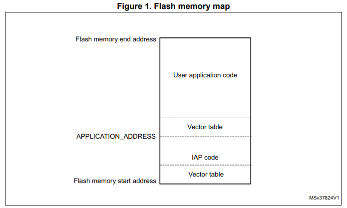

# In-Application-Programming
In-Application-Programming (IAP) allows upgrades without touching the board. This repo provides an IAP driver (for academic purpose) for updating the STM32 cards to update their programs remotely through Bluetooth interface.

## About
This project was carried out as part of a course **application based on embedded systems** at _Ecole Polytechnique de Tunisie_ under the supervision of [Mohamed Masmoudi](https://www.linkedin.com/in/med925/) and [Mohamed Abid](https://www.linkedin.com/in/abid-mohamed/).

## Work done by:
- [Sahar Ammar](https://www.linkedin.com/in/sahar-ammar-ba2847156/)
- [Firas Fredj](https://www.linkedin.com/in/firas-fredj/)

## Description
IAP is mainly about coding the job of the IDE (Truestudio, STM3CubeIDE, Keil, ...) which means receiving the binary file by Bluetooth then write it in the flash memory. The specific memory zone to write the new program is defined in the flash memory map.

The user application is likely to have independent stack and interrupt vectors (both are recommended but neither is mandatory). When the IAP driver directly launches the user application:

1. The IAP driver sets the main stack pointer to the application address
2. The next instruction executes the jump (unconditional branching) to the application.
3. The application then sets its own interrupt vector table as active.

## IAP driver description
The IAP driver contains the following set of source files:

- _boot_main.c_: where the USART initialization and RCC configuration are set. In the main we set the LED_4 to toggle every 0.1 second and waits until receiving and writing the hex file in the flash memory. After that, it jumps to the new start address and executes the received program.
- _Flash.c_: includes the functions needed to write in a flash memory.

## Utilisation
This project is tested on STM32F4411E-DISCO with HC-06 bluetooth adapter, but can be generalized to other STM32 cards and bluetooth adapters with needed modifications in the code depending on the hardware used.
